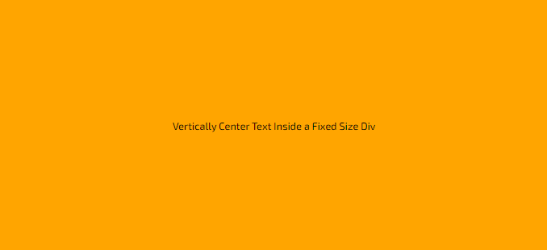

# Vertically Center Element

- [Vertically Center Element](#vertically-center-element)
  - [Vertically & Horizontally Center A Text/Element Inside A Fixed Size Div](#vertically--horizontally-center-a-textelement-inside-a-fixed-size-div)
    - [Output](#output)
    - [Code Structure](#code-structure)
  - [Old Way To Vertically Center An Element](#old-way-to-vertically-center-an-element)
  - [Vertically Center Using Relative-Absolute Position](#vertically-center-using-relative-absolute-position)
  - [Vertically Center Using Grid](#vertically-center-using-grid)

## Vertically & Horizontally Center A Text/Element Inside A Fixed Size Div

### Output



### Code Structure

```css
.vertical-horizontal-center-element {
  display: flex;
  /* justify-content will align it horizontally */
  justify-content: center;
  /* align-items will align it vertically */
  align-items: center;
  height: 50vh;
}
```

```html
<div class="vertical-horizontal-center-element">
  Vertically Center Text/Element Inside a Fixed Size Div
</div>
```

> Example: [Vertically and Horizontally Centered Element](example/index.html)

---

## Old Way To Vertically Center An Element

Old way was to use `display:table` and set its child to `display:table-cell` and set it to `vertical-align:middle`

```css
.table {
  display: table;
  height: 50vh;
  width: 100%;
  text-align: center;
}
.table h1 {
  display: table-cell;
  vertical-align: middle;
}
```

```html
<div class="table">
  <h1>Centered</h1>
</div>
```

> Example [Link](example/index.html)

---

## Vertically Center Using Relative-Absolute Position

```css
.parent {
  position: relative;
  height: 50vh;
}

.child {
  position: absolute;
  top: 50%;
  width: 100%;
  transform: translateY(-50%);
  text-align: center;
}
```

```html
<div class="parent">
  <p class="child">Centered Using Relative-Absolute Positioning</p>
</div>
```

> Example [Link](example/index.html)

---

## Vertically Center Using Grid

```css
.grid {
  display: grid;
  align-items: center;
  justify-content: center;
  height: 50vh;
}
```

OR using `place-items` which is short hand for `align-items` and `justify-items`

```css
.grid-pi {
  display: grid;
  place-items: center;
  height: 50vh;
}
```

OR Using Margins with Grid

```css
.grid-margin {
  display: grid;
  height: 50vh;
}

.grid-margin-child {
  margin: auto;
}
```

```html
<div class="grid">
  <p>Centered Using Grid</p>
</div>
<div class="grid-pi">
  <p>Centered Using Grid Place Items</p>
</div>
<div class="grid-margin">
  <div class="grid-margin-child">Centered Using Grid and Margins</div>
</div>
```

> Example [Link](example/index.html)

> Grid and Flex compared to table and relative-absolute, only has to be applied for parent and not for child.

> For Grid and Flexbox, `auto` margin on top and bottom will center them. But on block level it will not work.
