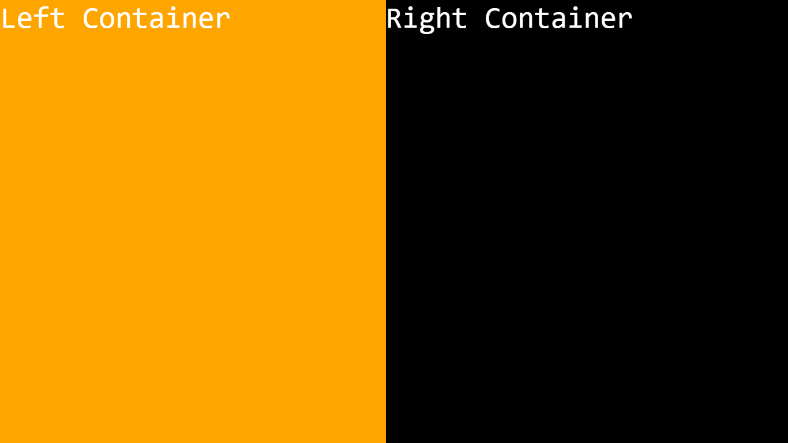

# Vertically Divided Elements

## Output



## Code Structure

```html
<div class="container">
    <div class="leftContainer">Left Container</div>
    <div class="rightContainer">Right Container</div>
</div>
```

```css
* {
    margin: 0;
    color: white;
    font-family: monospace;
}

.container {
    background-color: black;
    display: grid;
    /* grid-auto-flow: column; */
    grid-template-columns: auto auto;
    min-height: 100vh;
}

.leftContainer {
    background-color: orange;
}

.rightContainer {
    background-color: black;
}
```

> Click this [link](example/index.html) to view above example in action
