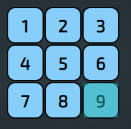

# CSS Notes

- [CSS Notes](#css-notes)
  - [Background Backdrop Filter](#background-backdrop-filter)
  - [`filter` Property](#filter-property)
  - [Difference Between `filter` and `backdrop-filter`](#difference-between-filter-and-backdrop-filter)
  - [Background-Size Property](#background-size-property)
  - [Using `calc()` In CSS](#using-calc-in-css)
    - [Notes](#notes)
  - [Orientation Based Styling](#orientation-based-styling)
  - [Smooth Scroll To Given Element](#smooth-scroll-to-given-element)
  - [Scroll With Padding Using `scroll-padding-top`](#scroll-with-padding-using-scroll-padding-top)
  - [`white-space` Property](#white-space-property)
  - [`overflow-wrap` Property](#overflow-wrap-property)
  - [`word-break` Property](#word-break-property)
  - [`hyphens` Property](#hyphens-property)
  - [`transition` Property](#transition-property)
  - [`position` Property](#position-property)
  - [Using `display-mode` in media rule](#using-display-mode-in-media-rule)
  - [`@import` Rule](#import-rule)
    - [Importing Font in CSS](#importing-font-in-css)
  - [`color-scheme` Property](#color-scheme-property)
  - [`pointer-events` Property](#pointer-events-property)
  - [Buttons Template Code](#buttons-template-code)
  - [Set the position on all four sides with one CSS property](#set-the-position-on-all-four-sides-with-one-css-property)
  - [Dark/Light Mode Using Media Query](#darklight-mode-using-media-query)
  - [CSS Units](#css-units)
    - [`em` vs `rem`](#em-vs-rem)
  - [Perspective CSS](#perspective-css)
  - [`::first-letter` and `::first-line` Selector](#first-letter-and-first-line-selector)
  - [Styling the Bullets in Lists using `::marker`](#styling-the-bullets-in-lists-using-marker)
  - [Using SVG for bullets in List](#using-svg-for-bullets-in-list)
  - [`mix-blend-mode` and `isolation` Property](#mix-blend-mode-and-isolation-property)
  - [`:hover` or `:active` doesn't work in IPhone's Safari](#hover-or-active-doesnt-work-in-iphones-safari)
  - [`currentColor` Keyword](#currentcolor-keyword)
  - [Custom Cursor For Your Website](#custom-cursor-for-your-website)
  - [Prevent Division Selection on Chrome (Android)](#prevent-division-selection-on-chrome-android)
  - [Prevent Screen Reader From Reading An Element Using `aria-hidden` Attribute](#prevent-screen-reader-from-reading-an-element-using-aria-hidden-attribute)
  - [`border` vs `outline`](#border-vs-outline)
  - [Using Shadow with Clip-Path](#using-shadow-with-clip-path)
  - [`quotes` CSS Property](#quotes-css-property)
  - [`content` CSS Property](#content-css-property)
  - [`aspect-ratio` CSS Property](#aspect-ratio-css-property)
  - [`writing-mode` CSS Property](#writing-mode-css-property)
  - [Reference](#reference)

## Background Backdrop Filter

The `backdrop-filter` CSS property lets you apply graphical effects such as blurring or color shifting to the ***area behind an element***. Because it applies to everything behind the element, to see the effect you must make the element or its background at least partially transparent.

```css
.blur {
    backdrop-filter: blur(2px);
}

.brightness {
    backdrop-filter: brightness(60%);
}

.contrast {
    backdrop-filter: contrast(40%);
}

.grayscale {
    backdrop-filter: grayscale(90%);
}

.hue {
    backdrop-filter: hue-rotate(120deg);
}

.invert {
    backdrop-filter: invert(70%);
}

.sepia {
    backdrop-filter: sepia(90%);
}

.saturate {
    backdrop-filter: saturate(80%);
}

.opacity {
    backdrop-filter: opacity(20%);
}

.drop-shadow {
    backdrop-filter: drop-shadow(4px 4px 10px blue);
}
```

| backdrop-filter | Description                                             |
| --------------- | ------------------------------------------------------- |
| `blur(px)`      | `blur()` will add blur effect                           |
| `brightness(%)` | `brightness()` will set the brightness                  |
| `contrast(%)`   | `contrast()` will change the contrast                   |
| `grayscale()`   | `grayscale()` will add black & white (grayscale) effect |
| `hue-rotate()`  | `hue-rotate()` will apply a hue rotation                |
| `invert()`      | `invert()` will invert the colors                       |
| `sepia()`       | `sepia()` will show sepia effect                        |
| `saturate()`    | `saturate()` will saturate the colors                   |
| `opacity()`     | `opacity()` sets transparency                           |
| `drop-shadow()` | `drop-shadow()` applies a drop shadow effect            |

 Example : [Backdrop-Filter](backdrop-example/)

## `filter` Property

The `filter` CSS property applies graphical effects like blur or color shift to an element. Filters are commonly used to adjust the rendering of images, backgrounds, and borders.

For filter refer above [`backdrop-filter`](#background-backdrop-filter) section

## Difference Between `filter` and `backdrop-filter`

|`backdrop-filter`|`filter`|
|-|-|
|Applies to area behind an element|Applies directly to an element|

---

## Background-Size Property

| Value                       | Description                                                                                                            |
| --------------------------- | ---------------------------------------------------------------------------------------------------------------------- |
| `background-size: contain;` | It will resize the image inside given element in such a way that nothing is cropped (so there can be negative space)   |
| `background-size: cover;`   | It will resize the image inside given element to fit it completely irrespective if it gets cropped (no negative space) |

## Using `calc()` In CSS

`calc()` as the name suggest helps to perform Calculations that you can set to required CSS property. It can be used anywhere a length, frequency, angle, time, percentage, number, or integer is allowed.

**Important Observation**: `calc(1000px- 800px)`,`calc(1000px -800px)` and `calc(1000px-800px)` given 3 expression doesn't work because operator needs to be seperated by a space i.e `calc(1000px - 800px)`

### Notes

- The `+` and `-` operators must be surrounded by whitespace. For instance, `calc(50% -8px)` will be parsed as a percentage followed by a negative length — an invalid expression — while `calc(50% - 8px)` is a percentage followed by a subtraction operator and a length. Likewise, `calc(8px + -50%)` is treated as a length followed by an addition operator and a negative percentage.
- The `*` and `/` operators do not require whitespace, but adding it for consistency is both allowed and recommended.
- Division by zero results in an error being generated by the HTML parser.
- Math expressions involving percentages for widths and heights on table columns, table column groups, table rows, table row groups, and table cells in both auto and fixed layout tables may be treated as if `auto` had been specified.
- It is permitted to nest `calc()` functions, in which case the inner ones are treated as simple parentheses.

---

## Orientation Based Styling

You can apply styling based on your device screen orientation by using `@media only screen and (orientation: landscape)` and `@media only screen and (orientation: portrait)`. For Example Consider below given css

```css
@media only screen and (orientation: landscape) {
    body {
        background-color: orangered;
    }
}

@media only screen and (orientation: portrait) {
    body {
        background-color: yellow;
    }
}
```

Given above code, will change the background color to orangered when device screen orientation is landscape and will change it background color to yellow if device orientation is portrait. Output of the above code is given below

Example: [Click Here](./orientation-example/)


---

## Smooth Scroll To Given Element

If you have ever referenced an internal element in your link, then you might have noticed that on click it jumps to that element directly. Which doesn't looks just as cool as `smooth-scroll` effect using css. You could simply add below code in your css and make your transition to that element way more cool.

```css
html {
    scroll-behavior: smooth;
}
```

[Click this link](./smooth-scroll/) to watch it in action

---

## Scroll With Padding Using `scroll-padding-top`

When using `smooth-scroll` or simply target navigation, you will notice that some times the target stick to the top. Which can look a bit off. So to handle the same with zero effort you can simply add `scroll-padding-top` to your css code. Example:

```css
body {
    scroll-padding-top: 4rem;
}
```

[Example Reference](https://developer.mozilla.org/en-US/docs/Web/CSS/scroll-padding-top)

---

## `white-space` Property

The `white-space` CSS property sets how white space inside an element is handled. The property specifies two things:

- Whether and how white-space is collapsed.
- Whether lines may wrap at soft-wrap opportunities.

> [`hyphens`](#hyphens-property) might be a better solution so check it out

|Values|Description|
|-|-|
|`white-space: normal;`|Sequences of white space are collapsed. Newline characters in the source are handled the same as other white space. Lines are broken as necessary to fill line boxes.|
|`white-space: nowrap;`|Collapses white space as for `normal`, but suppresses line breaks (text wrapping) within the source.|
|`white-space: pre;`|Sequences of white space are preserved. Lines are only broken at newline characters in the source and at `<br>` elements.|
|`white-space: pre-wrap;`|Sequences of white space are preserved. Lines are broken at newline characters, at `<br>`, and as necessary to fill line boxes.|
|`white-space: pre-line;`|Sequences of white space are collapsed. Lines are broken at newline characters, at `<br>`, and as necessary to fill line boxes.|
|`white-space: break-spaces;`|The behavior is identical to that of pre-wrap, except that: 1. Any sequence of preserved white space always takes up space, including at the end of the line. 2. A line breaking opportunity exists after every preserved white space character, including between white space characters. 3. Such preserved spaces take up space and do not hang, and thus affect the box’s intrinsic sizes (min-content size and max-content size).|

For Live Example [Click Here](https://developer.mozilla.org/en-US/docs/Web/CSS/white-space)

> **Note**: To make words break within themselves, use overflow-wrap, word-break, or hyphens instead.

---

## `overflow-wrap` Property

The `overflow-wrap` CSS property applies to inline elements, setting whether the browser should insert line breaks within an otherwise unbreakable string to prevent text from overflowing its line box. ***For Example when you want to break words like `thisisverylongunnecessaryexampleofveryveryverylongwordwithnonsense`, you can use `overflow-wrap: break-word;` Property***

> [`hyphens`](#hyphens-property) might be a better solution so check it out

|Values|Description|
|-|-|
|`overflow-wrap: normal;`|Lines may only break at normal word break points (such as a space between two words).|
|`overflow-wrap: break-word;`|To prevent overflow, an otherwise unbreakable string of characters — like a long word or URL — may be broken at any point if there are no otherwise-acceptable break points in the line. No hyphenation character is inserted at the break point. Soft wrap opportunities introduced by the word break are considered when calculating min-content intrinsic sizes.|
|`overflow-wrap: anywhere;`|The same as the anywhere value, with normally unbreakable words allowed to be broken at arbitrary points if there are no otherwise acceptable break points in the line, but soft wrap opportunities introduced by the word break are NOT considered when calculating min-content intrinsic sizes.|

For Live Example [Click Here](https://developer.mozilla.org/en-US/docs/Web/CSS/overflow-wrap)

## `word-break` Property

The `word-break` CSS property sets whether line breaks appear wherever the text would otherwise overflow its content box.

> [`hyphens`](#hyphens-property) might be a better solution so check it out

|Values|Description|
|-|-|
|`word-break: normal;`|Use the default line break rule.|
|`word-break: break-all;`|To prevent overflow, word breaks should be inserted between any two characters (excluding Chinese/Japanese/Korean text).|
|`word-break: keep-all;`|Word breaks should not be used for Chinese/Japanese/Korean (CJK) text. Non-CJK text behavior is the same as for `normal`.|
|`word-break: break-word; /* deprecated */`|Has the same effect as `word-break: normal` and `overflow-wrap: anywhere`, regardless of the actual value of the `overflow-wrap` property.|

> **Note**: In contrast to word-break: break-word and overflow-wrap: break-word (see overflow-wrap), word-break: break-all will create a break at the exact place where text would otherwise overflow its container (even if putting an entire word on its own line would negate the need for a break).

For Live Example [Click Here](https://developer.mozilla.org/en-US/docs/Web/CSS/word-break)

## `hyphens` Property

The `hyphens` CSS property specifies how words should be hyphenated when text wraps across multiple lines. It can prevent hyphenation entirely, hyphenate at manually-specified points within the text, or let the browser automatically insert hyphens where appropriate.

|Values|Description|
|-|-|
|`hyphens: none;`|Words are not broken at line breaks, even if characters inside the words suggest line break points. Lines will only wrap at whitespace.|
|`hyphens: manual;`|Words are broken for line-wrapping only where characters inside the word suggest line break opportunities.|
|`hyphens: auto;`|The browser is free to automatically break words at appropriate hyphenation points, following whatever rules it chooses. However, suggested line break opportunities will override automatic break point selection when present.|

For Live Example [Click Here](https://developer.mozilla.org/en-US/docs/Web/CSS/hyphens)

---

## `transition` Property

The `transition` CSS property is a shorthand property for `transition-property`, `transition-duration`, `transition-timing-function`, and `transition-delay`. So basically syntax is as follows:

```css
transition: transition-property transition-duration transition-timing-function transition-delay;
/*Example : transition: margin-right 2s ease-in-out .5s;*/
/* Apply to 1 property */
/* property name | duration */
transition: margin-right 4s;

/* property name | duration | delay */
transition: margin-right 4s 1s;

/* property name | duration | easing function */
transition: margin-right 4s ease-in-out;

/* property name | duration | easing function | delay */
transition: margin-right 4s ease-in-out 1s;

/* Apply to 2 properties */
transition: margin-right 4s, color 1s;

/* Apply to all changed properties */
transition: all 0.5s ease-out;
```

Transitions enable you to define the transition between two states of an element. Different states may be defined using pseudo-classes like `:hover` or `:active` or dynamically set using JavaScript.

|Property|Description|
|-|-|
|`transition-property`|The `transition-property` CSS property sets the CSS properties to which a transition effect should be applied. Ex. `all`, `none`, `width` or combination like `width, height`|
|`transition-duration`|The `transition-duration` CSS property sets the length of time a transition animation should take to complete. By default, the value is 0s, meaning that no animation will occur. Ex. 1s, 800ms|
|`transition-timing-function`|The `transition-timing-function` CSS property sets how intermediate values are calculated for CSS properties being affected by a transition effect. Ex. `ease`, `ease-in`, `ease-out`, `ease-in-out`, `linear`, `step-start`, `step-end`|
|`transition-delay`|The `transition-delay` CSS property specifies the duration to wait before starting a property's transition. Ex. 1s, 300ms|

> Note: Check Animatable Properties Here [Link](https://developer.mozilla.org/en-US/docs/Web/CSS/CSS_animated_properties)

For Live Example [Click Here](https://developer.mozilla.org/en-US/docs/Web/CSS/transition)

---

## `position` Property

|Value|Description|
|-|-|
|`position: static`|By default, position an element based on its current position in the flow. The `top`, `right`, `bottom`, `left` and `z-index` properties do not apply|
|`position: relative`|Position an element based on its current position without changing layout. The element is positioned according to the normal flow of the document, and then offset relative to itself based on the values of `top`, `right`, `bottom`, and `left`. The offset does not affect the position of any other elements; thus, the space given for the element in the page layout is the same as if position were `static`.|
|`position: absolute`|Position an element based on its closest positioned ancestor position. The element is removed from the normal document flow, and no space is created for the element in the page layout. It is positioned relative to its closest positioned ancestor, if any; otherwise, it is placed relative to the initial containing block. Its final position is determined by the values of `top`, `right`, `bottom`, and `left`.|
|`position: fixed`|The element is removed from the normal document flow, and no space is created for the element in the page layout. It is positioned relative to the initial containing block established by the viewport, except when one of its ancestors has a `transform`, `perspective`, or `filter` property set to something other than `none`, in which case that ancestor behaves as the containing block. Its final position is determined by the values of `top`, `right`, `bottom`, and `left`|
|`position: sticky`|The element is positioned according to the normal flow of the document, and then offset relative to its nearest scrolling ancestor and containing block (nearest block-level ancestor), including table-related elements, based on the values of `top`, `right`, `bottom`, and `left`. The offset does not affect the position of any other elements|

For Example [Click Here](https://developer.mozilla.org/en-US/docs/Web/CSS/position)

---

## Using `display-mode` in media rule

You can apply set of styles to elements based on the `display-mode`. For Example below code applies the styling to element when display mode is FullScreen

```CSS
@media all and (display-mode: fullscreen) {
    /* every CSS goes here that you want
    to apply or alter in the fullscreen mode*/
}
```

|Display Mode|Description|
|-|-|
|`fullscreen`|Used for FullScreen|
|`browser`|Used for view in conventional browser|
|`minimal-ui`|The application will look and feel like a standalone application, but will have a minimal set of UI elements for controlling navigation. The elements will vary by browser.|
|`standalone`|The application will look and feel like a standalone application. This can include the application having a different window, its own icon in the application launcher, etc. In this mode, the user agent will exclude UI elements for controlling navigation, but can include other UI elements such as a status bar.|

For More Details [Click Here](https://developer.mozilla.org/en-US/docs/Web/CSS/@media/display-mode)

---

## `@import` Rule

The `@import` rule also allows you to import another style sheet into given style sheet. The @import rule must be at the top of the document.

```css
@import url("anothercssfile.css");
/* or */
@import "anothercssfile.css";
```

---

### Importing Font in CSS

```css
@import url('https://fonts.googleapis.com/css2?family=Roboto:wght@100&display=swap');
```

You can use above code to import fonts in css.

---

## `color-scheme` Property

The `color-scheme` CSS property allows an element to indicate which color schemes it can comfortably be rendered in. Common choices for operating system color schemes are `light` and `dark`, or `day mode` and `night mode`. When a user selects one of these color schemes, the operating system makes adjustments to the user interface. This includes form controls, scrollbars, and the used values of CSS system colors.

```css
color-scheme: normal;
color-scheme: light;
color-scheme: dark;
color-scheme: light dark;
```

> The color-scheme property's value must be one of the following keywords: `normal`, `light` and `dark`.

---

## `pointer-events` Property

The `pointer-events` CSS property sets under what circumstances (if any) a particular graphic element can become the target of pointer events.

|Value|Description|
|-|-|
|`auto`|The element behaves as it would if the pointer-events property were not specified. In SVG content, this value and the value visiblePainted have the same effect.|
|`none`|The element is never the target of pointer events; however, pointer events may target its descendant elements if those descendants have pointer-events set to some other value. In these circumstances, pointer events will trigger event listeners on this parent element as appropriate on their way to/from the descendant during the event capture/bubble phases.|

```css
pointer-events: auto | none | visiblePainted | visibleFill | visibleStroke | visible | painted | fill | stroke | all | inherit
```

`visiblePainted`, `visibleFill`, `visibleStroke`, `visible`, `painted`, `fill`, `stroke`, `all` are all SVG only values and are applicable only on SVG elements.

---

## Buttons Template Code

A sample code for Big Button with shadow and linear gradient background and cursor as pointer. Sample Output:


```html
<button class="myButton">Button</button>
```

```css
.myButton {
    background: linear-gradient(45deg, purple, cyan);
    border: none;
    padding: 1rem;
    width: 10rem;
    border-radius: 1rem;
    color: white;
    font-weight: bold;
    box-shadow: 0px 0px 1px black;
    cursor: pointer;
}
```

---

## Set the position on all four sides with one CSS property

```css
.testdiv {
    position: absolute;
    top: 1rem;
    right: 4rem;
    bottom: 2rem;
    left: 3rem;
}
```

Above properties `top`, `right`, `bottom`, and `left` all can be replaced with one CSS property i.e `inset`. Below is the updated code for the one given above.

```css
.testdiv {
    position: absolute;
    inset: 1rem 2rem 3rem 4rem;
}
```

---

## Dark/Light Mode Using Media Query

Based on your System Theme mode you can change your website's Theme as well. Be it dark/light, the website will adjust itself to User's current mode. This can be done using `@media (prefers-color-scheme: dark/light)` where `dark` or `light` is your choice.

```css
:root {
    --background: orange;
    --textcolor: black;
}

@media (prefers-color-scheme: dark) {
    :root {
        --background: black;
        --textcolor: orange;
    }
}
```

Here above is the sample code that sets color for `background` variable and `textcolor` variable using `@media (prefers-color-scheme: dark)`. Here I have set the preference for `dark` theme. When you set the system theme to `dark` the `background` variable will get set to the value of `black` and `textcolor` variable will get set to the value of `orange`. And when you toggle system theme to `light` theme then `background` variable will get set to the value of `orange` and `textcolor` variable will get set to the value of `black`.

For Live Example [Click Here](https://aasisodiya.github.io/WebProjects/Notes/note-css/theme-media-query/)

---

## CSS Units

|Units|Notes|
|-|-|
|`rem`|Preferred for Font-Size. `rem` are like `em` but they are relative to the root element|
|`em`|Preferred for padding on Buttons|
|`%`|Preferred for Width|
|`ch`|It is the width of the font/character|
|`vh`|Preferred for heights. Can cause issues with Mobile Devices|
|`vmin`|Minimum of the 2 units i.e `vh` or `vw`|
|`vmax`|Maximum of the 2 units i.e `vh` or `vw`|

### `em` vs `rem`

|`em`|`rem`|
|-|-|
|`1em` generally defaults to `16px`|`rem` looks at the `html` font-size|
|It is always in relation to parents|It is in relation to `html` font-size|
|Font-size keeps compounding i.e if parents has changed its font-size, then the child element with `em` also gets changed|Doesn't compounds like `em`|
|`em` for margin equals to that element's font-size, i.e of elements font-size is 2rem and you set `margin: 1rem` then the margin is equal to its font-size. Same applies for `padding`, `left`, `top`, `right`, `bottom`, `width` and all such properties|`rem` here is still consistent with `html` font-size|

---

## Perspective CSS

`perspective` and `perspective-origin` are both set on an element’s parent container and determine the position of the vanishing point (i.e. the distance from the object’s plane from the position from which you are “looking” at the object), the object’s position and rotation is set using the transform property, which is declared on the object itself.

```css
.parent {
    perspective: 300px;
    -webkit-perspective: 300px;
    perspective-origin: center;
}
```

In Above snippet `perspective` is the depth / distance that you are viewing at or is the distance of camera/viewer/user from the object. `perspective-origin` is the position which can be `top`, `bottom`, `left`, `right` and `center` also combination of the same are allowed.

> Example [Link](perspective/)

---

## `::first-letter` and `::first-line` Selector

`::first-letter` Selector helps you select the first letter of the element. Using `::first-letter` selector you can create some great styles. 

`::first-line` selector helps you to select the first line of the paragraph. Using `::first-line` you can style out the first line as you need.

```css
.article::first-letter {
    color: orange;
    font-size: 2rem;
    font-weight: bold;
    float: left;
    margin-right: 0.5rem;
}

.article::first-line {
    color: orange;
}
```

> Example [Link](css-selector-example/)

---

## Styling the Bullets in Lists using `::marker`

You can easily style the bullets in Lists using `::marker` in CSS. `::marker` properties are not inherited. So you will have to apply them directly. `padding` and `margin` won't apply on `::marker` so you will have to apply those to parent.

```css
/* ::marker css example */
.custom-marker li::marker {
    color: orange;
    content: '-';
}

.custom-marker li {
    padding-left: 0.2em;
}

/* SVG Bullets */
ul.svg-marker {
    list-style: none;
}
```

> Example [Link](css-selector-example/)

---

## Using SVG for bullets in List

Below code is an example on how to use SVG as bullets for List

```css
.svg-marker > li {
    position: relative;
    padding-left: 0.2em;
}

.svg-marker li::before {
    --size: 1rem;
    content: '';
    display: inline-block;
    height: var(--size);
    width: var(--size);
    position: absolute;
    left: calc(-1 * var(--size));
    /* Adjusting top, might be not required for some other fonts */
    top: 0.2rem;
    background-image: url(img/alogo.svg);
    background-size: contain;
    background-repeat: no-repeat;
}
```

> Example [Link](css-selector-example/)

---

> You can use svg in content property

---

## `mix-blend-mode` and `isolation` Property

The `mix-blend-mode` CSS property sets how an element's content should blend with the content of the element's parent and the element's background. [Reference](https://developer.mozilla.org/en-US/docs/Web/CSS/mix-blend-mode). `mix-blend-mode` can be used with `isolation`. The `isolation` CSS property determines whether an element must create a new stacking context. [Reference](https://developer.mozilla.org/en-US/docs/Web/CSS/isolation)

`isolation` is applied on parent. Consider a case that div with respective class a,b,c where c has `mix-blend-mode` property applied and `a` has background, then `b` has the power to `isolate` by using `isolation` property. *Check Why `mix-blend-mode` doesn't work with body with background*

```css
.possibleValues {
  mix-blend-mode: normal;
  mix-blend-mode: multiply;
  mix-blend-mode: screen;
  mix-blend-mode: overlay;
  mix-blend-mode: darken;
  mix-blend-mode: lighten;
  mix-blend-mode: color-dodge;
  mix-blend-mode: color-burn;
  mix-blend-mode: hard-light;
  mix-blend-mode: soft-light;
  mix-blend-mode: difference;
  mix-blend-mode: exclusion;
  mix-blend-mode: hue;
  mix-blend-mode: saturation;
  mix-blend-mode: color;
  mix-blend-mode: luminosity;
  /* isolation */
  isolation: auto;
  isolation: isolate;
}
```

> Example [Link](mix-blend-mode-example/)

---

## `:hover` or `:active` doesn't work in IPhone's Safari

Solution is to add `ontouchstart` to the body tag. [Reference](https://stackoverflow.com/questions/3885018/active-pseudo-class-doesnt-work-in-mobile-safari)

---

## `currentColor` Keyword

The currentColor keyword represents the value of an element's color property. This lets you use the color value on properties that do not receive it by default. If currentColor is used as the value of the color property, it instead takes its value from the inherited value of the color property.

Sample Code using `currentColor` Keyword to set the division border color same as its element's color

```css
.sameTextAndBorderColorDiv {
    color: orange;
    background: black;
    border: 1px solid currentColor;
}
```

---

## Custom Cursor For Your Website

You can add a custom cursor for your website with a simple css code. `cursor` property helps to achieve that. Sample code for which is given below.

```css
body {
    cursor: url(./img/cursor.svg), auto;
}
```

What we have done here is, set an image named `cursor.svg` as our cursor. `auto` here stands as backup in case `cursor.svg` has some issues. Some important points for cursor images are:

- Cursor image can be of formats: `png` and `svg`. These are preferred because of transparency.
- Cursor image cannot be bigger than `128×128px`. Larger cursor images are ignored.

In case you are unable to see your cursor, make sure above conditions holds true. BTW One personal observation - on exporting a custom cursor I created in Adobe Illustrator didn't worked in my website. Even though the size of svg was `25×25px` which is well under `128×128px`. So after some debugging adding one line of code to my svg helped i.e `width='25' height='25'` was added to svg tag line.

```svg
<svg id="Layer_1" data-name="Layer 1" xmlns="http://www.w3.org/2000/svg" width='25' height='25' viewBox="0 0 23.49 23.49">
```

> Example [Link](web-cursor/)

---

## Prevent Division Selection on Chrome (Android)

On Android Chrome, when you select a div it gets highlighted sometimes. For example as given below



Now to prevent this you can use a simple CSS code i.e `-webkit-tap-highlight-color: transparent;`. You can also use below complete css code to prevent selection completely.

```css
.noselect{
    -webkit-tap-highlight-color: transparent;
    -webkit-touch-callout: none;
    -webkit-user-select: none;
    -khtml-user-select: none;
    -moz-user-select: none;
    -ms-user-select: none;
    user-select: none;
}
```

---

## Prevent Screen Reader From Reading An Element Using `aria-hidden` Attribute

You can prevent a screen reader from reading an element tag by using `aria-hidden` Attribute. All you need to do is add `aria-hidden="true"`. The `aria-hidden` attribute can either expose or hide non-interactive content from the accessibility API.

Adding `aria-hidden="true"` to an element removes that element and all of its children from the accessibility tree. This can improve the experience for assistive technology users by hiding:

- purely decorative content, such as icons or images
- duplicated content, such as repeated text
- offscreen or collapsed content, such as menus

According to the fourth rule of ARIA, aria-hidden="true" should not be used on a focusable element. Additionally, since this attribute is inherited by an element's children, it should not be added onto the parent or ancestor of a focusable element.

Using `aria-hidden="false"` will not re-expose the element to assistive technology if any of its parents specify `aria-hidden="true"`.

> Reference: [Link](https://developer.mozilla.org/en-US/docs/Web/Accessibility/ARIA/ARIA_Techniques/Using_the_aria-hidden_attribute)

Example

```html
<p aria-hidden="true">
  Some things are better left unsaid.
</p>
```

---

## `border` vs `outline`

|`border`|`outline`|
|-|-|
|`border` of an element takes space|`outline` doesn't take any space|
|You can have rounded corner|Rounded corners aren't supported|

---

## Using Shadow with Clip-Path

For applying shadow to and Element with `clip-path`, you can simply wrap the element inside another div and then applying `filter` property with `drop-shadow` value. (i.e. applied on parent of clipped child) Sample Example is given below

```html
<div class="rotor-wrap">
    <div class="rotor"></div>
</div>
```

```css
.rotor {
    background: orange;
    width: 100px;
    height: 100px;
    clip-path: polygon(50% 0%, 100% 100%, 0% 100%);
}
.rotor-wrap {
    filter: drop-shadow(0px 0px 5px orange);
}
```

> Example [Link](../../26Animations/19OnTouchAnimation/)

---

## `quotes` CSS Property

The quotes CSS property sets how the browser should render quotation marks that are added using the open-quotes or close-quotes values of the CSS content property. Can only be used with `<q>` tag

```css
q {
/* <string> values */
  quotes: "«" "»";           /* Set open-quote and close-quote to the French quotation marks */
  quotes: "«" "»" "‹" "›";   /* Set two levels of quotation marks */
}
```

---

## `content` CSS Property

The `content` CSS property replaces an element with a generated value. Objects inserted using the content property are anonymous replaced elements. Also just an observation `content` property only works with `::after` and `::before`

```css
.contentValues {
/* Keywords that cannot be combined with other values */
content: normal;
content: none;

/* <image> values */
content: url("http://www.example.com/test.png");
content: linear-gradient(#e66465, #9198e5);
content: image-set("image1x.png" 1x, "image2x.png" 2x);

/* alt text for generated content, added in the Level 3 specification */
content: url("http://www.example.com/test.png") / "This is the alt text";

/* <string> value */
content: "prefix";

/* <counter> values, optionally with <list-style-type> */
content: counter(chapter_counter);
content: counter(chapter_counter, upper-roman);
content: counters(section_counter, ".");
content: counters(section_counter, ".", decimal-leading-zero);

/* attr() value linked to the HTML attribute value */
content: attr(value string);

/* Language- and position-dependent keywords */
content: open-quote;
content: close-quote;
content: no-open-quote;
content: no-close-quote;

/* Except for normal and none, several values can be used simultaneously */
content: open-quote counter(chapter_counter);
}
```

> [Reference](https://developer.mozilla.org/en-US/docs/Web/CSS/content) & [Example](./content-example/)

---

## `aspect-ratio` CSS Property

The `aspect-ratio` CSS property sets a preferred aspect ratio for the box, which will be used in the calculation of auto sizes and some other layout functions.

```css
aspect-ratio: 1 / 1;
aspect-ratio: 16 / 9;
/* aspect-ratio: width / height; */
```

`1 / 1` represents a Ratio. The box’s preferred aspect ratio is the specified ratio of `width` / `height`. Size calculations involving preferred aspect ratio work with the dimensions of the box specified by box-sizing.

> An observation: aspect-ration will be over-ridden if content is bigger [Example Link](./aspect-ratio/)

---

## `writing-mode` CSS Property

The writing-mode CSS property sets whether lines of text are laid out horizontally or vertically, as well as the direction in which blocks progress. When set for an entire document, it should be set on the root element (html element for HTML documents). [Reference](https://developer.mozilla.org/en-US/docs/Web/CSS/writing-mode)

```css
writing-mode: vertical-rl;
```

---

## Reference

- [Calc()](https://developer.mozilla.org/en-US/docs/Web/CSS/calc())
- [white-space](https://developer.mozilla.org/en-US/docs/Web/CSS/white-space)
- [Position](https://developer.mozilla.org/en-US/docs/Web/CSS/position)
