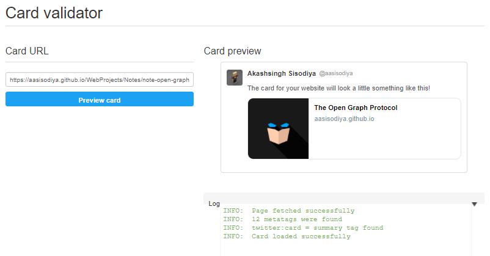

# The Open Graph Protocol

## Introduction

What is Open Graph Protocol? - *The Open Graph protocol enables any web page to become a rich object in a social graph. For instance, this is used on Facebook to allow any web page to have the same functionality as any other object on Facebook.* - [Source](https://ogp.me/). Open Graph Protocol helps you decide what you want to display on any social website whenever you or any one shares your website link.

Some points to note about The Open Graph Protocol

- The Open Graph protocol was originally created at Facebook and is inspired by Dublin Core, link-rel canonical, Microformats, and RDFa.
- It is currently being consumed by Facebook (see their documentation), Google (see their documentation), and mixi.
- It is being published by IMDb, Microsoft, NHL, Posterous, Rotten Tomatoes, TIME, Yelp, and many many others.
- Search Engines Mostly Ignores Them
- Has No Direct SEO Benefits

## Implementation

To turn your web pages into graph objects, you need to add basic metadata to your page. The `<meta>` tags are placed in the `<head>` of our web page.

### Basic Metadata

The four **required properties** for every page are:

|Property|Description|
|-|-|
|`og:title`|The title of your object as it should appear within the graph. It can only have 95 characters|
|`og:type`|The type of your object, e.g., video, blog, article, etc.|
|`og:image`|An image URL which should represent your object within the graph.|
|`og:url`|The canonical URL of your object that will be used as its permanent ID in the graph, e.g., "https://www.imdb.com/title/tt0117500/".|

#### Example

```html
<meta property="og:title" content="Open Graph Protocol" />
<meta property="og:type" content="website" />
<meta property="og:image" content="url/to/image.png" />
<meta property="og:url" content="content/url" />
```

### Optional Metadata

The following properties are optional for any object and are generally recommended:

|Property|Description|
|`og:audio`|A URL to an audio file to accompany this object.|
|`og:description`|A one to two sentence description of your object.|
|`og:determiner`|The word that appears before this object's title in a sentence. An enum of (a, an, the, "", auto). If auto is chosen, the consumer of your data should chose between "a" or "an". Default is "" (blank).|
|`og:locale`|The locale these tags are marked up in. Of the format language_TERRITORY. Default is `en_US`.|
|`og:locale:alternate`|An array of other locales this page is available in.|
|`og:site_name`|If your object is part of a larger web site, the name which should be displayed for the overall site. e.g., "IMDb".|
|`og:video`|A URL to a video file that complements this object.|

#### Example of Optional Metadata

```html
<meta property="og:audio" content="/url/to/audio.file" />
<meta property="og:description" content="Sample Description" />
<meta property="og:determiner" content="the" />
<meta property="og:locale" content="en_GB" />
<meta property="og:locale:alternate" content="fr_FR" />
<meta property="og:locale:alternate" content="es_ES" />
<meta property="og:site_name" content="aasisodiya" />
<meta property="og:video" content="/url/to/video.file" />
```

### Structured Properties

Some properties can have extra metadata attached to them. These are specified in the same way as other metadata with property and content.

#### A Full Image Example

```html
<meta property="og:image" content="https://example.com/ogp.jpg" />
<meta property="og:image:secure_url" content="https://secure.example.com/ogp.jpg" />
<meta property="og:image:type" content="image/jpeg" />
<meta property="og:image:width" content="400" />
<meta property="og:image:height" content="300" />
<meta property="og:image:alt" content="A shiny red apple with a bite taken out" />
```

#### Video Tag Example

```html
<meta property="og:video" content="https://example.com/movie.swf" />
<meta property="og:video:secure_url" content="https://secure.example.com/movie.swf" />
<meta property="og:video:type" content="application/x-shockwave-flash" />
<meta property="og:video:width" content="400" />
<meta property="og:video:height" content="300" />
```

#### Audio Tag Example

```html
<meta property="og:audio" content="https://example.com/sound.mp3" />
<meta property="og:audio:secure_url" content="https://secure.example.com/sound.mp3" />
<meta property="og:audio:type" content="audio/mpeg" />
```

## Object Types

In order for your object to be represented within the graph, you need to specify its type. This is done using the og:type property:

```html
<meta property="og:type" content="website" />
```

Types are:

1. Music
2. Video
3. Article
4. Book
5. Profile
6. Website

```html
<meta property="og:article:author" content="Akash">
```

> [Example](example/)

Sample output for above example looks like below on WhatsApp.


## Twitter Card Validator

You can check the preview of your card using [Twitter Card Validator](https://cards-dev.twitter.com/validator). Sample output looks like below.



## Reference

- [The Open Graph protocol](https://ogp.me/)
- [Open Graph Stories](https://developers.facebook.com/docs/sharing/opengraph)
